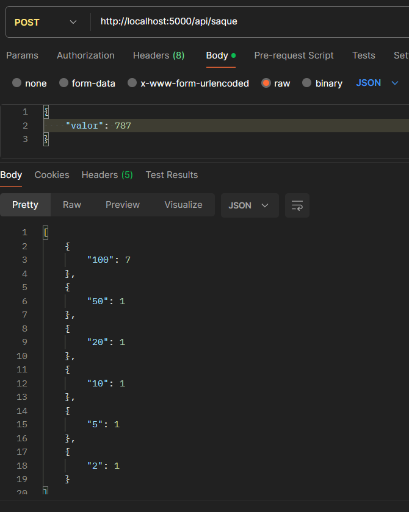
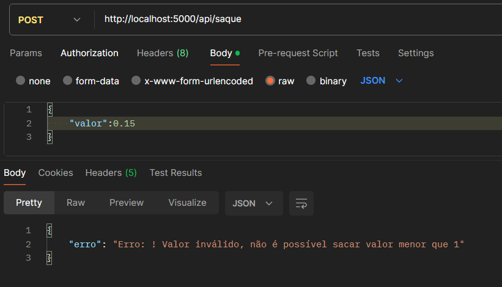
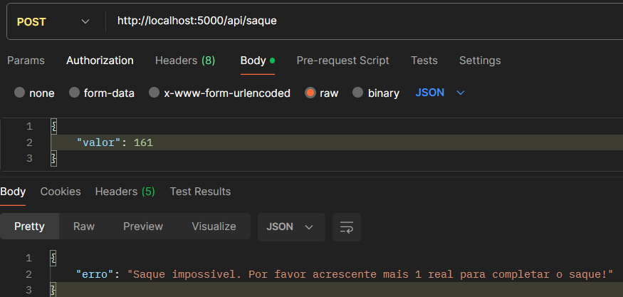
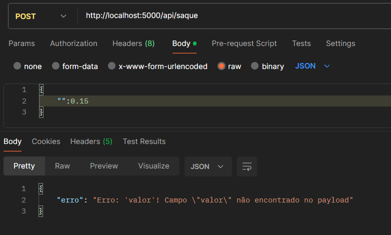
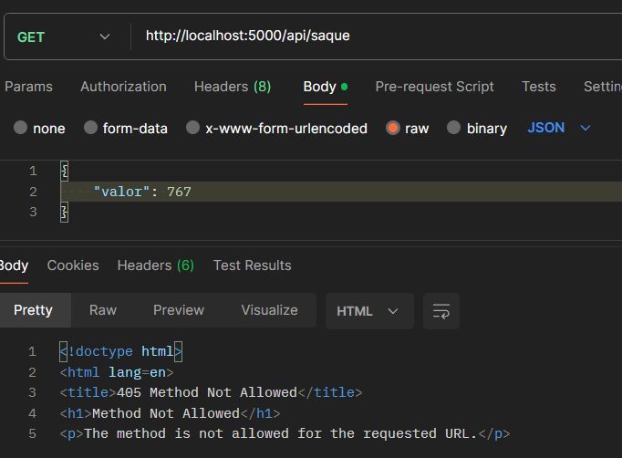
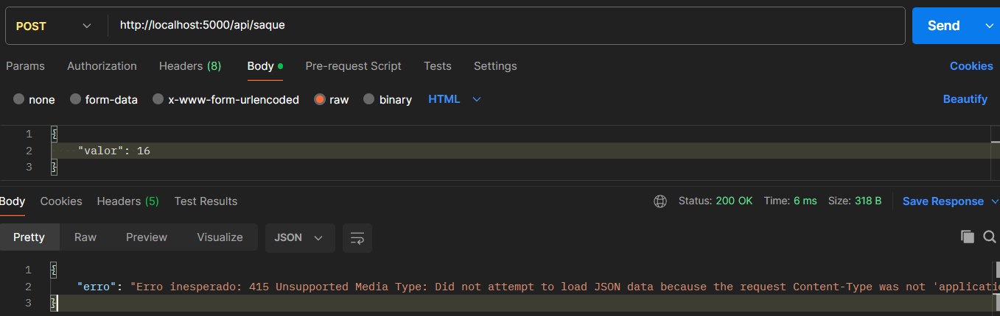
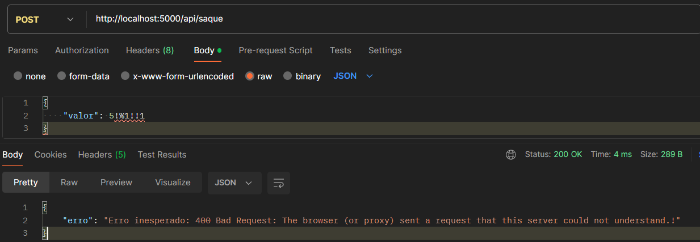

# Morada.AI Challenge
 Desafio

## Resumo e Explicação do Projeto
Este projeto tem como objetivo emular uma api de saque em caixa eletrônico. Ele foi desenvolvido como parte do desafio proposto pela empresa Morada.AI . A aplicação oferece um serviço de saque de cédulas de 100,50,20,10,5 e 2 reais conforme entrada de valor a retirar proposta pelo úsuario.

## Instalação de Pacotes
Para instalar os pacotes necessários, siga os passos abaixo:

1. Clone o repositório:
    ```bash
    git clone https://github.com/seu-usuario/seu-repositorio.git
    ```

2. Crie um ambiente virtual (opcional, mas recomendado):
    ```bash
    python -m venv env
    source env/bin/activate  # No Windows, use `env\Scripts\activate`
    ```

3. Instale as dependências:
    ```bash
    pip install -r requirements.txt
    ```

Seguindo esses passos será possivel rodar a aplicação localmente sem menores problemas com versão ou dependências.

## Modo de Uso
Após a instalação dos pacotes, você pode executar a aplicação seguindo os passos abaixo:

1. Certifique-se de que o ambiente virtual está ativado (se você criou um).

2. Execute o script principal:
    ```bash
    python main.py
    ```

3. 2. Execute um comando curl ou use o postman para fazer uma requisição no endpoint da aplicação (http://localhost:5000/api/saque):
    ```bash
    curl -X POST -H "Content-Type: application/json" -d '{"valor": 380}' http://localhost:5000/api/saque

    # Usando Postman GUI 

    

    Lembre-se de usar o método post e o formato de arquivo como json.
    
    ```
## Testes efetuados
A seguir alguns exemplos de testes que foram efetuados.









## Desafios e Problemas Encontrados
Durante o desenvolvimento deste projeto, enfrentamos alguns desafios, incluindo:

- Essa foi minha primeira experiência criando uma API em python usando flask. Durante este tempo de desafio foi necessario aprofundar e entender conceitos importantes de projetos como esse e aprender a usar novas ferramentas como o Postman para teste de funcionalidade.
- Normalmente uso o sistema operacional Windows e não pude usar o commando curl no terminal para testar a aplicação da forma como proposta. Porém usando de pesquisas na web foi possivel contornar o problema para testar a aplicação totalmente sem por menores.
- Com o desafio pude aprimorar minhas habilidades e desbravar novos conhecimentos que só seriam possiveis a partir dele, além de acrescentar demasiadamente com novas skills e conhecimentos de documentações que jamais conheceria no meu escopo de vivência.

Espero que isso ajude! Sinta-se à vontade para personalizar cada seção com informações detalhadas sobre o seu projeto.